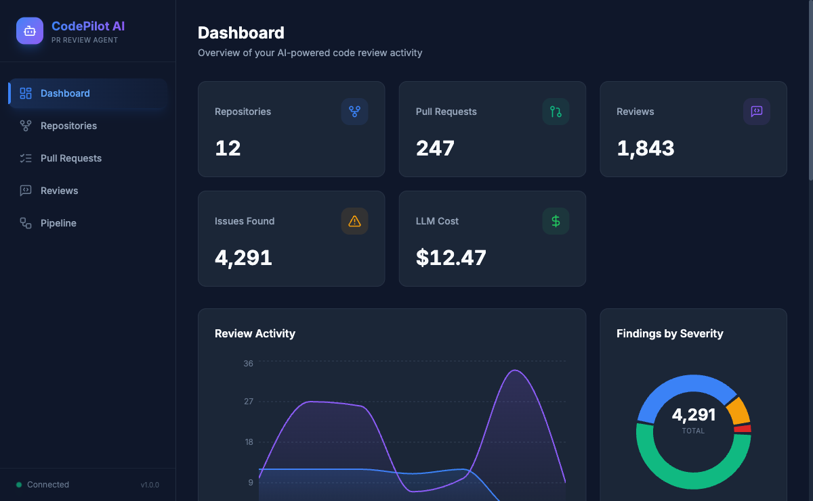
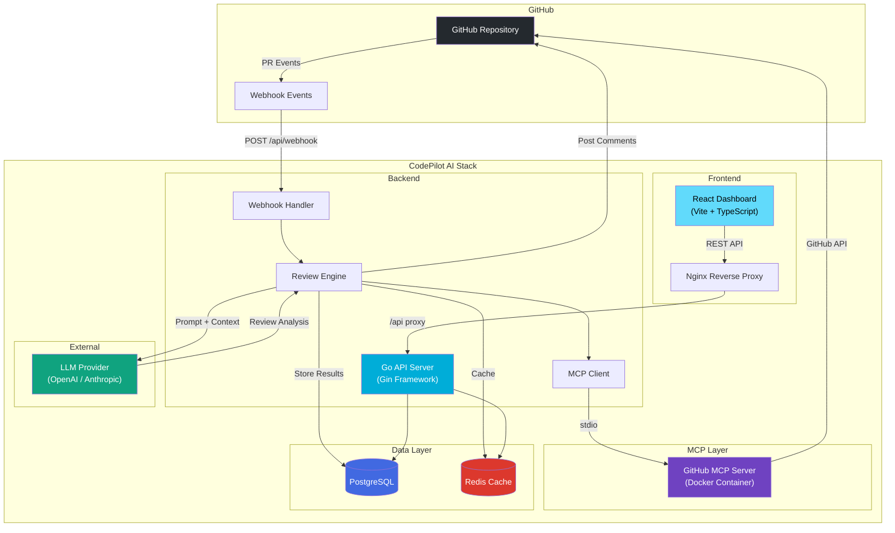

<div align="center">

# 🤖 CodePilot AI

### MCP-Powered GitHub PR Review Agent

[](https://go.dev)
[](https://react.dev)
[](https://www.postgresql.org)
[](https://docs.docker.com/compose/)
[](LICENSE)
[](https://code-pilot-ai-pr-review-agent.vercel.app/)
[](https://arts-tank-action-economic.trycloudflare.com)

**CodePilot AI** is an intelligent, automated code review agent that integrates with GitHub Pull Requests using the **Model Context Protocol (MCP)**. It analyzes diffs, provides contextual feedback, catches bugs, suggests improvements, and posts review comments — all powered by LLMs.

**🔗 Try it:** [Demo (UI only)](https://code-pilot-ai-pr-review-agent.vercel.app/) · [Full app + real backend](https://arts-tank-action-economic.trycloudflare.com) <sub>(self-hosted — may be intermittent)</sub> · [Quick Start](#-quick-start) · [Architecture](#-architecture) · [Pipeline](docs/AI_PIPELINE.md) · [Deployment](#-deployment)

<br/>



</div>

<!-- NOTE: the "Full app" URL is a Cloudflare quick tunnel and is EPHEMERAL — it changes whenever the
     VM/cloudflared restarts. Update it here (2 places above) when it changes, or switch to a permanent
     URL (named tunnel + domain, or DuckDNS + Caddy) — see docs/DEPLOY_ORACLE.md. -->

> **Two ways to try it:**
> - **Demo (UI only)** — the React dashboard in demo mode (built-in sample data, no backend); always on.
> - **Full app + real backend** — the complete stack (real PR reviews) self-hosted on a free VM behind a
>   Cloudflare tunnel. It **may be intermittent**; if the link is down, it's just been restarted.
>
> Full-stack self-hosting steps: [docs/DEPLOY_ORACLE.md](docs/DEPLOY_ORACLE.md).

---

## 📋 Table of Contents

- [Features](#-features)
- [Architecture](#-architecture)
- [Tech Stack](#-tech-stack)
- [Prerequisites](#-prerequisites)
- [Quick Start](#-quick-start)
- [Manual Setup](#-manual-setup)
- [Configuration](#-configuration)
- [API Reference](#-api-reference)
- [Screenshots](#-screenshots)
- [Development](#-development)
- [Testing](#-testing)
- [Deployment](#-deployment)
- [Contributing](#-contributing)
- [License](#-license)

---

## ✨ Features

| Feature | Description |
|---------|-------------|
| 🔍 **Automated PR Reviews** | Triggered by GitHub webhooks on PR open/update events |
| 🧠 **MCP Integration** | Uses GitHub's official MCP server for rich context retrieval |
| 💬 **Inline Comments** | Posts contextual review comments directly on PR diffs |
| 📊 **Review Dashboard** | React-based dashboard to view review history and analytics |
| 🔄 **Multi-Model Support** | Pluggable LLM providers (OpenAI, Anthropic, local models) |
| 📈 **Review Analytics** | Track review quality, response times, and code patterns |
| 🐳 **One-Command Deploy** | Full Docker Compose setup — `docker-compose up` and go |
| 🔐 **Secure by Design** | Webhook signature verification, non-root containers, env-based secrets |

---

## 🏗 Architecture



### Data Flow

1. **Webhook Received** → GitHub sends a PR event to `/api/webhook`
2. **Validation** → Backend verifies the webhook signature (HMAC-SHA256)
3. **Context Gathering** → MCP client spawns the GitHub MCP server to fetch PR diff, file contents, and repo context
4. **LLM Analysis** → The review engine constructs a prompt with the gathered context and sends it to the configured LLM
5. **Review Posting** → Parsed review comments are posted back to the PR via the GitHub API
6. **Storage** → Review results are persisted in PostgreSQL; LLM responses are cached in Redis

---

## 🛠 Tech Stack

| Layer | Technology | Purpose |
|-------|-----------|---------|
| **Backend** | Go 1.23 + Gin | REST API, webhook handling, review orchestration |
| **Frontend** | React 18 + Vite + TypeScript | Review dashboard and analytics UI |
| **Database** | PostgreSQL 16 | Persistent storage for reviews, repos, and config |
| **Cache** | Redis 7 | LLM response caching, rate limiting, job queues |
| **MCP Server** | GitHub MCP Server | Context retrieval via Model Context Protocol |
| **LLM** | OpenAI / Anthropic | Code analysis and review generation |
| **Proxy** | Nginx | Static file serving, API reverse proxy |
| **Container** | Docker + Compose | Orchestration and deployment |

---

## 📦 Prerequisites

| Requirement | Version | Check Command |
|-------------|---------|---------------|
| Docker | 20.10+ | `docker --version` |
| Docker Compose | 2.0+ | `docker compose version` |
| Go *(for local dev)* | 1.23+ | `go version` |
| Node.js *(for local dev)* | 20+ | `node --version` |
| GitHub PAT | — | [Create one](https://github.com/settings/tokens) |

---

## 🚀 Quick Start

Get CodePilot AI running in under 2 minutes:

```bash
# 1. Clone the repository
git clone https://github.com/your-org/codepilot-ai.git
cd codepilot-ai

# 2. Configure environment
cp .env.example .env
# Edit .env with your GitHub PAT and LLM API key

# 3. Launch everything
docker-compose up -d

# 4. Verify
curl http://localhost:8080/api/health
# → {"status":"healthy","version":"..."}
```

**That's it!** 🎉

| Service | URL |
|---------|-----|
| Frontend Dashboard | [http://localhost:3000](http://localhost:3000) |
| Backend API | [http://localhost:8080](http://localhost:8080) |
| PostgreSQL | `localhost:5432` |
| Redis | `localhost:6379` |

---

## 🔧 Manual Setup

<details>
<summary><strong>Step-by-step for local development (without Docker)</strong></summary>

### 1. Database

```bash
# Start PostgreSQL (or use an existing instance)
brew install postgresql@16  # macOS
sudo systemctl start postgresql  # Linux

# Create the database
createdb codepilot
```

### 2. Redis

```bash
brew install redis  # macOS
redis-server &
```

### 3. Backend

```bash
# Install dependencies
go mod download

# Run migrations
make migrate-up

# Start the server
make run
```

### 4. Frontend

```bash
cd frontend
npm install
npm run dev
```

### 5. GitHub Webhook

For local development, use a tunnel:

```bash
# Using ngrok
ngrok http 8080

# Set the webhook URL in GitHub:
# https://<your-id>.ngrok.io/api/webhook
```

</details>

---

## ⚙️ Configuration

All configuration is managed via environment variables. See [.env.example](.env.example) for defaults.

| Variable | Description | Default | Required |
|----------|-------------|---------|----------|
| `SERVER_HOST` | Bind address | `0.0.0.0` | No |
| `SERVER_PORT` | API port | `8080` | No |
| `APP_ENVIRONMENT` | `development` or `production` | `development` | No |
| `LOG_LEVEL` | Log verbosity (`debug`, `info`, `warn`, `error`) | `debug` | No |
| `DB_HOST` | PostgreSQL host | `postgres` | Yes |
| `DB_PORT` | PostgreSQL port | `5432` | No |
| `DB_USER` | Database username | `codepilot` | Yes |
| `DB_PASSWORD` | Database password | — | Yes |
| `DB_NAME` | Database name | `codepilot` | Yes |
| `DB_SSL_MODE` | SSL mode (`disable`, `require`) | `disable` | No |
| `REDIS_HOST` | Redis host | `redis` | Yes |
| `REDIS_PORT` | Redis port | `6379` | No |
| `GITHUB_PERSONAL_ACCESS_TOKEN` | GitHub PAT with `repo` scope | — | **Yes** |
| `GITHUB_WEBHOOK_SECRET` | Webhook HMAC secret | — | **Yes** |
| `GITHUB_MCP_IMAGE` | MCP server Docker image | `ghcr.io/github/github-mcp-server` | No |
| `LLM_PROVIDER` | LLM backend (`openai`, `anthropic`) | `openai` | Yes |
| `LLM_API_KEY` | LLM provider API key | — | **Yes** |
| `LLM_MODEL` | Model identifier | `gpt-4o` | No |
| `LLM_MAX_TOKENS` | Max response tokens | `4096` | No |
| `LLM_TEMPERATURE` | Sampling temperature | `0.3` | No |

---

## 📡 API Reference

### Health Check

```
GET /api/health
```

**Response** `200 OK`:
```json
{
  "status": "healthy",
  "version": "20260705",
  "uptime": "2h15m30s",
  "database": "connected",
  "redis": "connected"
}
```

### Webhook Endpoint

```
POST /api/webhook
```

Receives GitHub webhook events. Must be configured with the correct secret for signature verification.

**Headers**:
- `X-GitHub-Event`: Event type (e.g., `pull_request`)
- `X-Hub-Signature-256`: HMAC-SHA256 signature

### Repositories

```
GET    /api/repositories          # List monitored repositories
POST   /api/repositories          # Add a repository
GET    /api/repositories/:id      # Get repository details
DELETE /api/repositories/:id      # Remove a repository
```

### Reviews

```
GET    /api/reviews               # List all reviews
GET    /api/reviews/:id           # Get review details with comments
POST   /api/reviews/:id/retry     # Retry a failed review
```

### Analytics

```
GET    /api/analytics/summary     # Review summary statistics
GET    /api/analytics/trends      # Review trends over time
```

---

## 📸 Screenshots

> Screenshots will be added once the frontend is complete.

| View | Description |
|------|-------------|
| **Dashboard** | Overview of recent PR reviews and statistics |
| **Review Detail** | Individual PR review with inline comments |
| **Repository Settings** | Configure repositories and review preferences |
| **Analytics** | Charts showing review trends and code quality metrics |

---

## 💻 Development

### Project Structure

```
codepilot-ai/
├── cmd/
│   └── server/           # Application entrypoint
├── internal/
│   ├── config/            # Configuration loading
│   ├── handlers/          # HTTP handlers (Gin)
│   ├── middleware/         # Auth, logging, rate-limiting
│   ├── models/            # Database models
│   ├── mcp/               # MCP client integration
│   ├── review/            # Review engine & LLM orchestration
│   └── github/            # GitHub API client
├── pkg/
│   └── utils/             # Shared utilities
├── frontend/
│   ├── src/               # React source code
│   ├── Dockerfile          # Frontend Docker build
│   └── nginx.conf          # Nginx configuration
├── migrations/            # SQL migration files
├── docs/                  # Documentation
│   ├── architecture.md
│   └── deployment.md
├── docker-compose.yml     # Full-stack orchestration
├── Dockerfile             # Backend Docker build
├── Makefile               # Dev automation
├── .env.example           # Environment template
└── README.md              # You are here
```

### Make Targets

```bash
make help            # Show all available targets
make build           # Compile Go binary
make run             # Run backend locally
make test            # Run tests with coverage
make lint            # Run golangci-lint
make docker-up       # Start all services
make docker-down     # Stop all services
make docker-logs     # Follow service logs
make migrate-up      # Apply database migrations
make frontend-dev    # Start Vite dev server
make frontend-build  # Build frontend for production
```

---

## 🧪 Testing

```bash
# Run all tests with race detection and coverage
make test

# Run a specific package
go test -v ./internal/review/...

# Generate HTML coverage report
go tool cover -html=coverage.out -o coverage.html
open coverage.html
```

---

## 🚢 Deployment

### Production with Docker Compose

```bash
# Build production images
docker-compose build

# Start in detached mode
docker-compose up -d

# Monitor logs
docker-compose logs -f backend
```

### Full stack for free (real PR reviews)

Run the whole thing (backend + Postgres + on-demand MCP container) on a free **Oracle Cloud
Always-Free** VM, exposed over HTTPS with a free **Cloudflare Tunnel**. Copy-paste runbook:
**[docs/DEPLOY_ORACLE.md](docs/DEPLOY_ORACLE.md)**.

### Live demo — frontend on Vercel (free, always-on)

The React dashboard ships with a **demo mode** (`VITE_DEMO_MODE=true`) that serves built-in sample
data with no backend — ideal for a portfolio link. Deploy it in ~2 minutes:

1. Push this repo to GitHub (done).
2. On [vercel.com](https://vercel.com) → **New Project** → import this repo.
3. Set:
   - **Root Directory:** `frontend`
   - **Framework Preset:** Vite (auto-detected) · Build: `npm run build` · Output: `dist`
   - **Environment Variable:** `VITE_DEMO_MODE` = `true`
4. **Deploy.** Vercel gives you a `https://<project>.vercel.app` URL. Update the Live Demo link at the
   top of this README to match.

SPA routing is handled by `frontend/vercel.json`. Netlify / Cloudflare Pages work the same way (same
root dir, build, output, and env var).

### Production Checklist

- [ ] Set `APP_ENVIRONMENT=production` in `.env`
- [ ] Use strong, unique passwords for `DB_PASSWORD` and `GITHUB_WEBHOOK_SECRET`
- [ ] Set up SSL/TLS termination (Nginx, Cloudflare, or a load balancer)
- [ ] Configure GitHub webhook to point to your public URL
- [ ] Set up log aggregation (ELK, Loki, or CloudWatch)
- [ ] Configure database backups (pg_dump cron job)
- [ ] Set resource limits in `docker-compose.yml` for production workloads

For a comprehensive deployment guide, see [docs/deployment.md](docs/deployment.md).

---

## 🤝 Contributing

Contributions are welcome! Please follow these steps:

1. **Fork** the repository
2. **Create** a feature branch: `git checkout -b feature/amazing-feature`
3. **Commit** your changes: `git commit -m 'Add amazing feature'`
4. **Push** to the branch: `git push origin feature/amazing-feature`
5. **Open** a Pull Request

### Guidelines

- Follow Go conventions (`go fmt`, `go vet`)
- Write tests for new features
- Update documentation for API changes
- Keep PR scope focused — one feature per PR

---

## 📄 License

This project is licensed under the **MIT License**. See [LICENSE](LICENSE) for details.

---

<div align="center">

## 🎯 Project Summary

**CodePilot AI** demonstrates production-grade skills in:

| Area | Technologies & Concepts |
|------|------------------------|
| **Backend Engineering** | Go, REST APIs, webhook processing, middleware chains, graceful shutdown |
| **AI/LLM Integration** | Model Context Protocol (MCP), prompt engineering, multi-model support |
| **Frontend Development** | React 18, TypeScript, Vite, responsive dashboard design |
| **Infrastructure & DevOps** | Docker multi-stage builds, Compose orchestration, Nginx reverse proxy |
| **Database Design** | PostgreSQL schema design, migrations, connection pooling |
| **System Design** | Event-driven architecture, caching strategies, horizontal scaling |
| **Security** | HMAC webhook verification, non-root containers, secret management |
| **Code Quality** | Comprehensive testing, linting, CI/CD readiness, clean architecture |

*Built with ❤️ as a portfolio project showcasing full-stack + AI engineering capabilities.*

</div>
