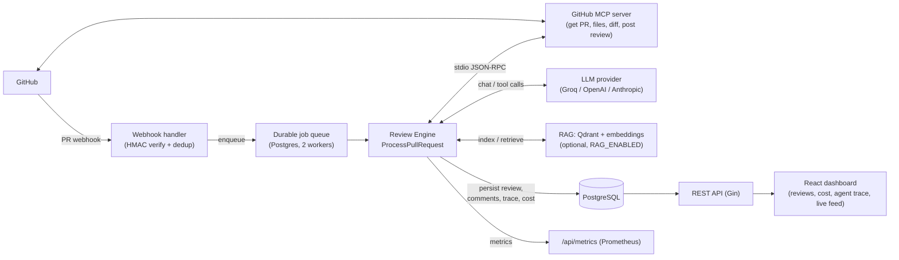
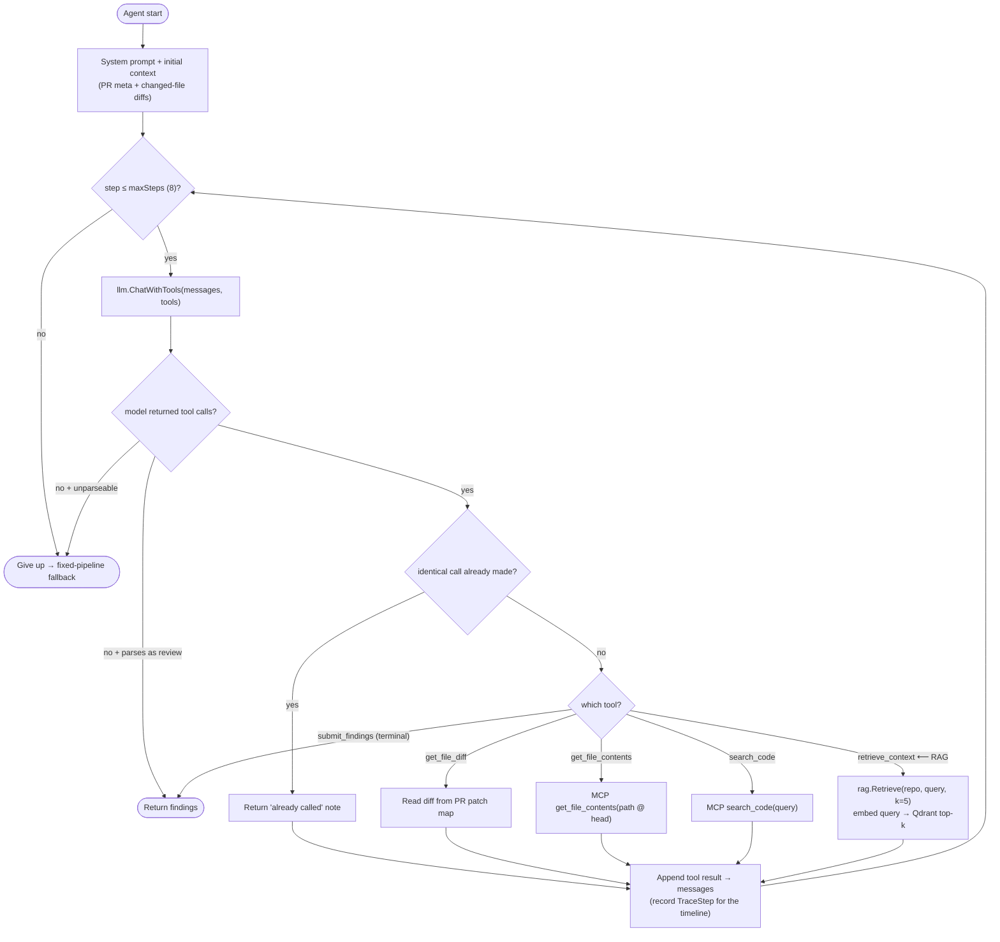
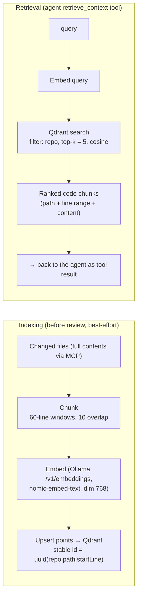
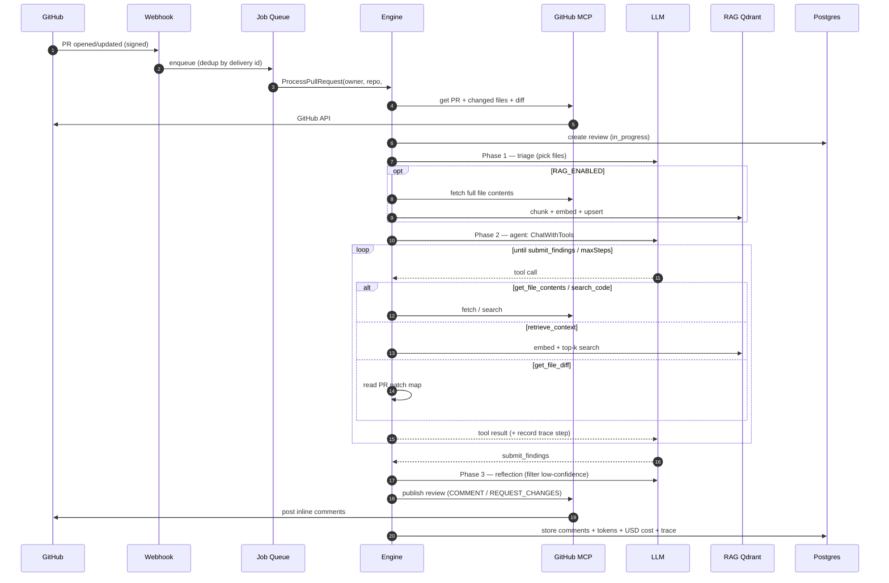

# CodePilot AI — AI Pipeline Blueprint

End-to-end blueprint of the review pipeline: how a GitHub PR event turns into posted review
comments, **which tools the agent calls, and exactly when RAG is used**. Diagrams are Mermaid
(render on GitHub). Code references point at the real implementation.

- Orchestration: `internal/review/engine.go` (`ProcessPullRequest`) + `internal/review/phases.go`
- Agent loop: `internal/agent/` · LLM + tools: `internal/llm/` · RAG: `internal/rag/`
- MCP client (GitHub): `internal/mcp/` · MCP server (ours): `internal/mcpserver/`, `cmd/mcp-server/`

---

## 1. High-level system architecture

---

## 2. End-to-end review pipeline (per PR)

The engine runs a **three-phase** pipeline. Phase 2 is the autonomous agent, with a deterministic
fallback. Every step is written to `execution_logs` (the *agent trace* shown in the UI).

```mermaid
flowchart TD
    START(["Job: owner/repo #PR"]) --> LOOKUP["Repo lookup + auto-review gate"]
    LOOKUP -->|"inactive / auto-review off"| STOP(["Skip"])
    LOOKUP --> FETCH["Fetch PR + changed files + diff via MCP"]
    FETCH --> REC["Create review record (status=in_progress)"]
    REC --> BUILD["Build file contexts<br/>exclude patterns, skip lockfiles,<br/>truncate patch to 2000 chars"]
    BUILD --> SORT["SortByPriority<br/>(security/high-churn first)"]

    SORT --> P1{"Phase 1 — Triage<br/>files ≥ triageSkipThreshold (4)?"}
    P1 -->|"no (small PR)"| ALL["Review all files"]
    P1 -->|"yes"| TRIAGE["LLM triage (triage model)<br/>pick ≤ maxPriorityFiles (8)<br/>from ≤ maxTriageFiles (20)"]
    TRIAGE --> SEL["Selected files"]
    ALL --> RAGIDX
    SEL --> RAGIDX

    RAGIDX{"RAG_ENABLED?"} -->|"yes"| IDX["Index changed files → Qdrant<br/>(indexForRAG, best-effort)"]
    RAGIDX -->|"no"| P2
    IDX --> P2

    P2{"Phase 2 — Review<br/>llmClient.SupportsTools()?"}
    P2 -->|"yes"| AGENT["Run AGENT tool-use loop<br/>(see §3)"]
    P2 -->|"no / agent errored"| FIXED["Fixed single-shot review<br/>runReview (JSON mode)"]
    AGENT -->|"agent error"| FIXED
    AGENT --> FINDINGS["Findings + summary"]
    FIXED --> FINDINGS

    FINDINGS --> POST["Domain rules:<br/>AdjustSeverities → Deduplicate →<br/>remove already-published"]
    POST --> P3["Phase 3 — Reflection (reflection model)<br/>validate each finding;<br/>drop confidence < 0.7 or is_valid=false"]
    P3 --> PUB["Publish to GitHub via MCP<br/>event = REQUEST_CHANGES if any critical, else COMMENT"]
    PUB --> STORE["Store comments + per-phase tokens + USD cost<br/>UpdateCounts / UpdateUsage / metrics"]
    STORE --> DONE(["status=completed"])
```

**Phase → model → purpose** (models resolved by `engine.resolveModels`; each phase can use a
different tier for cost — `LLM_TRIAGE/REVIEW/REFLECTION_MODEL`):

| Phase | Model tier | Purpose | Key code |
|---|---|---|---|
| 1 · Triage | cheap/fast | Pick the files worth deep review (skipped for < 4 files) | `phases.go` `runTriage` |
| 2 · Review | strong | Produce findings (agentic; fallback single-shot) | `agent/agent.go`, `phases.go` `runReview` |
| 3 · Reflection | cheap/fast | Self-critique; filter low-confidence / invalid findings | `phases.go` `runReflection` |

---

## 3. The agent tool-use loop (Phase 2) — **where RAG is called**

When the model supports tool calling, Phase 2 is an autonomous agent that **decides which tools to
call** before submitting findings. This is the core of "what tools it is calling, and when it uses
RAG." Loop code: `internal/agent/agent.go` · tool schemas: `internal/agent/tools.go`.

### Agent tool inventory

| Tool | When the model calls it | Backing implementation |
|---|---|---|
| `get_file_diff(path)` | Inspect the exact diff of a changed file | In-memory PR patch map (no I/O) |
| `get_file_contents(path)` | See full surrounding code / a definition at PR head | MCP `get_file_contents` (`internal/mcp`) |
| `search_code(query)` | Find where a symbol/function is defined or used | MCP `search_code` |
| **`retrieve_context(query)`** | **Semantic cross-file context beyond the diff** | **RAG: `rag.Service.Retrieve` (Qdrant) — only registered when `RAG_ENABLED`** |
| `submit_findings(summary, findings[])` | Terminal — end the loop with the review | Parsed into `ReviewResult` |

**Guardrails:** bounded `maxSteps` (8), identical-call **dedup**, tool-result truncation
(`maxToolResultChars` = 4000), structured-output findings, and a token budget tracked per step.
`retrieve_context` is offered **only when a RAG retriever is configured**; otherwise the agent works
from diffs + MCP file reads/search alone.

---

## 4. RAG: index and retrieve (only when `RAG_ENABLED`)

RAG gives the reviewer cross-file context (a called function's definition, related code) that isn't
in the diff. Code: `internal/rag/` (`chunk.go`, `embed.go`, `qdrant.go`, `service.go`).

- **Index trigger:** `engine.indexForRAG` runs before Phase 2 for the PR's (triaged) changed files —
  best-effort, never fails the review. Embeddings via a pluggable OpenAI-compatible endpoint
  (default local **Ollama** sidecar). Stable point IDs mean re-indexing overwrites, not duplicates.
- **Retrieval:** the agent's `retrieve_context` tool → `rag.Retrieve(repo, query, 5)` →
  embed → Qdrant repo-filtered search. Grows more useful across PRs as more code is indexed.

---

## 5. Sequence diagram — one full review

---

## 6. Decision gates (the "when")

| Gate | Condition | Config / constant | Effect |
|---|---|---|---|
| Auto-review | repo active **and** `AutoReview` (or manual retry) | repo settings | else skip |
| Triage vs review-all | changed files ≥ `triageSkipThreshold` | `= 4` (`engine.go`) | small PRs skip triage |
| Triage cap | list ≤ `maxTriageFiles`, pick ≤ `maxPriorityFiles` | `20` / `8` | bounds triage tokens |
| Agent vs fixed | `llmClient.SupportsTools()` **and** agent succeeds | `LLM` capability | else deterministic fallback |
| RAG on/off | `RAG_ENABLED` **and** retriever ready | env | gates indexing + `retrieve_context` tool |
| Agent stop | `submit_findings` called, or `maxSteps` hit | `= 8` (`agent.go`) | ends loop |
| Finding kept | confidence ≥ threshold **and** `is_valid` | `= 0.7` (`engine.go`) | reflection filter |
| Review event | any critical finding | severity rules | `REQUEST_CHANGES` else `COMMENT` |

---

## 7. Observability & cost (what gets recorded)

- **Agent trace** — every phase + each agent tool call is an `execution_logs` row (step, status,
  duration, message). Read via `GET /api/reviews/:id/logs` (per-review timeline) and
  `GET /api/dashboard/activity` (live feed). See `internal/services/review_service.go`,
  `internal/services/dashboard_service.go`.
- **Cost/tokens** — per-phase input/output tokens × per-model price (`internal/llm/pricing.go`,
  `CostUSD`) accumulated and stored as `cost_usd` / `input_tokens` / `output_tokens` on the review.
- **Metrics** — `/api/metrics` (Prometheus): reviews, tokens, cost, duration, agent tool calls, HTTP.

---

## 8. MCP surface (client + server)

CodePilot is **both** an MCP client and an MCP server.

| Direction | Tools | Where |
|---|---|---|
| **Consumes** (GitHub MCP server) | `pull_request_read`, `get_file_contents`, `search_code`, `pull_request_review_write`, `add_comment_to_pending_review` | `internal/mcp/client.go` |
| **Exposes** (our MCP server, stdio) | `retrieve_code_context`, `get_review`, `list_findings`, `search_reviews` | `internal/mcpserver/`, `cmd/mcp-server/` |

---

## 9. Key tunables (env)

`RAG_ENABLED`, `QDRANT_URL`, `EMBEDDINGS_BASE_URL`/`_MODEL`/`_DIM`,
`LLM_PROVIDER`/`_MODEL`, `LLM_TRIAGE_MODEL`/`LLM_REVIEW_MODEL`/`LLM_REFLECTION_MODEL`,
`LLM_MAX_TOKENS`/`_TEMPERATURE`, `GITHUB_MCP_IMAGE`/`_TOOLSETS`. See `.env.example` and
`internal/config/config.go`.

> **Fallback guarantee:** any single failure degrades gracefully — no RAG → agent uses diffs + MCP;
> no tool support / agent error → deterministic single-shot review; MCP publish fails → findings are
> still stored locally; unknown model price → cost recorded as $0. The pipeline never hard-crashes a
> review on an optional dependency.
