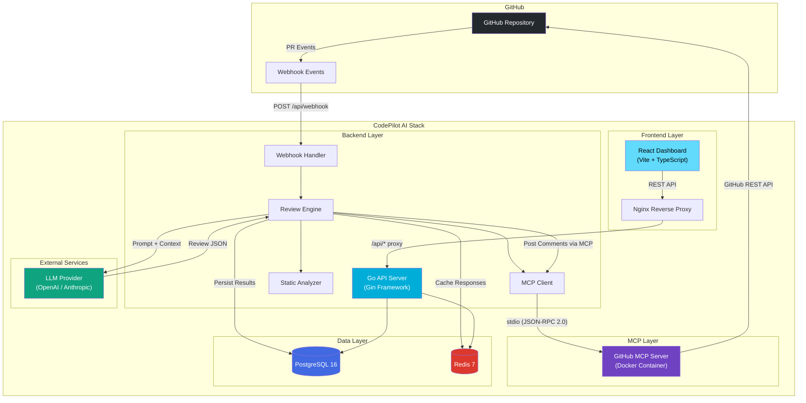
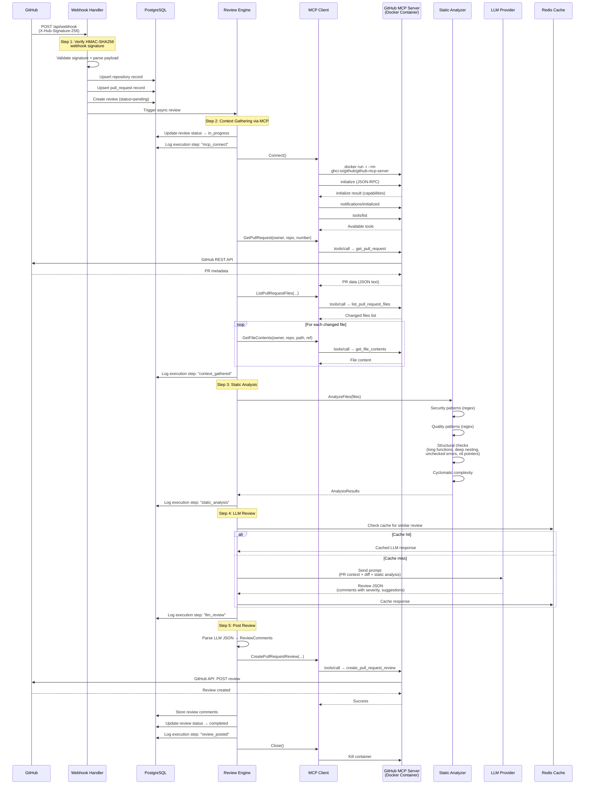
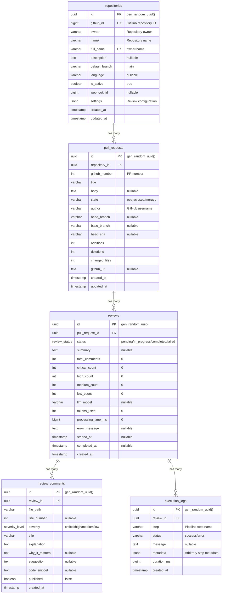

# 🏗 CodePilot AI — Architecture Document

> Deep dive into the system design, data flow, and technical decisions behind CodePilot AI.

---

## Table of Contents

- [System Overview](#system-overview)
- [Component Descriptions](#component-descriptions)
- [Data Flow](#data-flow)
- [MCP Integration](#mcp-integration)
- [Review Pipeline](#review-pipeline)
- [Static Analysis](#static-analysis)
- [LLM Integration](#llm-integration)
- [Database Schema](#database-schema)
- [API Design](#api-design)
- [Design Decisions & Trade-offs](#design-decisions--trade-offs)
- [Security Considerations](#security-considerations)
- [Future Enhancements](#future-enhancements)

---

## System Overview

CodePilot AI is an event-driven PR review agent. GitHub webhook events trigger an automated review pipeline that fetches PR context via the Model Context Protocol (MCP), runs static analysis, sends context to an LLM for intelligent review, and posts inline comments back to the PR.



### Key Characteristics

| Property | Description |
|---|---|
| **Architecture Style** | Event-driven, monolithic backend (modular packages) |
| **Communication** | REST (HTTP/JSON) for API; stdio JSON-RPC for MCP |
| **Data Storage** | PostgreSQL (relational) + Redis (cache/queue) |
| **Concurrency Model** | Go goroutines; reviews processed asynchronously |
| **Deployment** | Docker Compose (4 services + on-demand MCP containers) |

---

## Component Descriptions

### Backend Packages (`internal/`)

| Package | Responsibility | Key Types/Functions |
|---|---|---|
| `internal/config` | Environment-based configuration loading & validation | `Config`, `Load()`, `Validate()` |
| `internal/database` | PostgreSQL connection pooling, migration runner | `NewPostgresDB()`, `RunMigrations()` |
| `internal/models` | Domain models matching database schema | `Repository`, `PullRequest`, `Review`, `ReviewComment`, `ExecutionLog`, `DashboardStats` |
| `internal/services` | Data access layer (repository pattern over raw SQL) | `RepositoryService` — CRUD + settings management |
| `internal/mcp` | MCP client, stdio transport, JSON-RPC protocol types | `Client`, `StdioTransport`, `Request`, `Response`, `Tool` |
| `internal/analyzer` | Deterministic static analysis engine | `Analyzer`, `AnalyzeFiles()`, `SecurityPatterns()`, `QualityPatterns()`, `CalculateCyclomaticComplexity()` |

### Shared Packages (`pkg/`)

| Package | Responsibility | Key Types/Functions |
|---|---|---|
| `pkg/errors` | Typed, domain-specific errors that map to HTTP status codes | `NotFoundError`, `ValidationError`, `InternalError`, `ConflictError`, `UnauthorizedError`, `ToHTTPStatus()`, `ToErrorResponse()` |
| `pkg/logger` | Structured logging with zerolog; request-scoped logging via context | `Init()`, `WithContext()`, `SetRequestID()`, `Log` (global logger) |

### Frontend (`frontend/`)

| Component | Technology | Purpose |
|---|---|---|
| Framework | React 18 + TypeScript | Component-based UI |
| Build Tool | Vite | Fast builds and HMR |
| Serving | Nginx (in Docker) | Static file serving + API reverse proxy |

### Infrastructure

| Component | Technology | Purpose |
|---|---|---|
| Database | PostgreSQL 16 Alpine | Persistent storage for all domain data |
| Cache | Redis 7 Alpine | LLM response caching, rate limiting, job queues |
| MCP Server | `ghcr.io/github/github-mcp-server` | GitHub context retrieval via MCP protocol |
| Container Runtime | Docker + Compose | Orchestration and deployment |

---

## Data Flow

### Webhook → Review Pipeline

The following sequence diagram traces a PR event from GitHub through the complete review pipeline:



---

## MCP Integration

### How It Works

CodePilot AI communicates with GitHub through the **Model Context Protocol (MCP)** — an open protocol for connecting AI applications to external tools and data sources.

### Architecture

The MCP integration consists of three layers:

```
┌──────────────────────┐
│    Review Engine      │  ← High-level: GetPullRequest(), ListFiles(), etc.
├──────────────────────┤
│    MCP Client         │  ← Protocol: initialize, tools/list, tools/call
├──────────────────────┤
│   StdioTransport      │  ← I/O: Docker process management, stdin/stdout pipes
├──────────────────────┤
│  GitHub MCP Server    │  ← Container: ghcr.io/github/github-mcp-server
│  (Docker container)   │
└──────────────────────┘
```

### Container Lifecycle

The `StdioTransport` manages the MCP server as an ephemeral Docker container:

1. **Spawn**: `docker run -i --rm -e GITHUB_PERSONAL_ACCESS_TOKEN=... ghcr.io/github/github-mcp-server`
2. **Communicate**: Read/write newline-delimited JSON-RPC 2.0 over stdin/stdout
3. **Destroy**: Kill the container process and reap it when the review completes

Key details:
- The `-i` flag keeps stdin open for bidirectional communication
- The `--rm` flag ensures automatic cleanup
- The GitHub PAT is passed as an environment variable (never written to disk)
- A 16 MB read buffer handles large responses (e.g., file contents)

### JSON-RPC 2.0 Protocol

All communication uses the JSON-RPC 2.0 protocol over stdio:

**Request format:**
```json
{
  "jsonrpc": "2.0",
  "id": 1,
  "method": "tools/call",
  "params": {
    "name": "get_pull_request",
    "arguments": {
      "owner": "octocat",
      "repo": "hello-world",
      "pull_number": 42
    }
  }
}
```

**Response format:**
```json
{
  "jsonrpc": "2.0",
  "id": 1,
  "result": {
    "content": [
      {
        "type": "text",
        "text": "{\"title\": \"Fix bug\", \"state\": \"open\", ...}"
      }
    ],
    "isError": false
  }
}
```

**Notification format (no ID, no response):**
```json
{
  "jsonrpc": "2.0",
  "method": "notifications/initialized"
}
```

### MCP Handshake Sequence

1. **`initialize`** — Client sends protocol version and client info; server responds with capabilities
2. **`notifications/initialized`** — Client confirms initialization is complete
3. **`tools/list`** — Client discovers available tools

### Available MCP Tools Used

| Tool Name | Purpose | Arguments |
|---|---|---|
| `get_pull_request` | Fetch PR metadata (title, body, state, author, branches) | `owner`, `repo`, `pull_number` |
| `list_pull_request_files` | List files changed in a PR with diff patches | `owner`, `repo`, `pull_number` |
| `get_file_contents` | Retrieve full file content at a specific git ref | `owner`, `repo`, `path`, `ref` |
| `create_pull_request_review` | Submit a review with inline comments | `owner`, `repo`, `pull_number`, `body`, `event`, `comments[]` |
| `search_code` | Search for code patterns across the repository | `q` (query string) |

### MCP Type System

The protocol uses strongly typed Go structs for serialization:

| Type | Purpose |
|---|---|
| `Request` | JSON-RPC 2.0 request (jsonrpc, id, method, params) |
| `Response` | JSON-RPC 2.0 response (jsonrpc, id, result, error) |
| `RPCError` | Structured error (code, message, data) |
| `Tool` | Tool descriptor (name, description, inputSchema) |
| `Content` | Result content piece (type: "text" or "image") |
| `CallToolResult` | Tool execution result (content[], isError) |
| `ReviewCommentInput` | PR review comment (path, line, body) |

---

## Review Pipeline

The review pipeline is the core processing flow. Each step is logged to the `execution_logs` table for observability.

### Step 1: Webhook Reception & Validation

- Receive `POST /api/webhook` from GitHub
- Verify the `X-Hub-Signature-256` header using HMAC-SHA256 with `GITHUB_WEBHOOK_SECRET`
- Parse the `X-GitHub-Event` header (only process `pull_request` events)
- Extract PR payload: action (`opened`, `synchronize`, `reopened`), repository info, PR metadata
- Skip reviews for draft PRs (configurable via `review_on_draft` setting)
- Upsert repository and pull request records in the database
- Create a new review record with `status = pending`

### Step 2: Context Gathering (MCP)

- Spawn the GitHub MCP server Docker container
- Perform the MCP handshake (initialize → initialized notification → tools/list)
- Fetch PR metadata: title, body, state, base/head branches, SHA
- List changed files: filenames, status (added/modified/deleted), patch diffs
- Retrieve full contents of changed files (at the head ref) for deeper analysis
- Close the MCP connection and destroy the container

### Step 3: Static Analysis

- Run deterministic checks on all changed files (see [Static Analysis](#static-analysis))
- Calculate cyclomatic complexity per file
- Identify security vulnerabilities, code quality issues, and structural problems
- Produce a structured `AnalysisResults` object with issues tagged by severity

### Step 4: LLM Review

- Check Redis cache for a prior review of the same diff hash
- Construct a prompt including: PR context, file diffs, static analysis findings
- Send to the configured LLM provider (OpenAI or Anthropic)
- Parse the JSON response into structured review comments
- Cache the response in Redis for deduplication

### Step 5: Review Posting

- Map LLM-generated comments to `ReviewCommentInput` structs (path, line, body)
- Submit the review via MCP's `create_pull_request_review` tool
- Persist all review comments to the `review_comments` table
- Update the review record: status → `completed`, token counts, processing time
- Log the final execution step

### Error Handling

If any step fails:
- The review status is set to `failed`
- The error message is stored in the review's `error_message` field
- The execution log captures the failed step with metadata
- The review can be retried via `POST /api/reviews/:id/retry`

---

## Static Analysis

The `internal/analyzer` package performs deterministic, LLM-independent code analysis. It runs before the LLM step to provide structured findings that augment the LLM's context.

### Security Patterns

Regex-based detection of security vulnerabilities:

| Rule | Severity | What It Detects |
|---|---|---|
| `hardcoded-secret` | Critical | API keys, secrets, access tokens in source code |
| `hardcoded-password` | Critical | Passwords in string literals |
| `private-key` | Critical | RSA/DSA/EC/OPENSSH private keys embedded in code |
| `sql-injection` | Critical | User input interpolated into SQL via `fmt.Sprintf` or f-strings |
| `sql-concat` | Critical | SQL queries built with string concatenation of user input |
| `xss-innerhtml` | High | Direct DOM manipulation with `innerHTML`/`outerHTML` |
| `xss-dangerously-set` | High | React's `dangerouslySetInnerHTML` usage |
| `insecure-hash` | High | MD5/SHA1 usage (deprecated for security) |
| `tls-skip-verify` | High | `InsecureSkipVerify: true` disabling TLS verification |
| `exec-injection` | High | Shell command execution without input sanitization |
| `insecure-random` | Medium | `math/rand` instead of `crypto/rand` |
| `cors-wildcard` | Medium | CORS configured with wildcard `*` origin |

### Quality Patterns

| Rule | Severity | What It Detects |
|---|---|---|
| `race-condition-go` | Medium | Goroutines launched with closures (potential data races) |
| `empty-catch` | Medium | Empty `catch`/`except` blocks that swallow errors |
| `panic-in-library` | Medium | `panic()` usage in library code (should return errors) |
| `console-log` | Low | `console.log/debug/info/warn/error` statements |
| `print-debug` | Low | `fmt.Println`, `print()` debug statements |
| `global-variable` | Low | Package-level mutable variables |
| `deep-import` | Low | Importing from another module's `internal/` package |
| `http-status-number` | Low | Numeric HTTP status codes instead of named constants |

### Structural Checks

| Check | Threshold | Description |
|---|---|---|
| **Long Functions** | > 50 lines | Functions exceeding 50 lines flagged for refactoring |
| **Deep Nesting** | > 4 levels | Brace depth (or Python indent depth) exceeding 4 levels |
| **Large Files** | > 500 lines | Files over 500 lines suggest decomposition |
| **TODO Comments** | — | `TODO`, `FIXME`, `HACK`, `XXX` in comment context |
| **Magic Numbers** | ≥ 3 digits | Numeric literals in comparisons/assignments without named constants |
| **Unchecked Errors** | — | Go `_, _ :=` pattern discarding error return values |
| **Nil Pointer Risk** | — | Map/slice access followed by immediate dereference without nil check |
| **Unused Parameters** | — | Function parameters not referenced in the function body |

### Cyclomatic Complexity

The analyzer calculates cyclomatic complexity per file by counting decision points:

| Language | Decision Points Counted |
|---|---|
| **Go** | `if`, `else`, `case`, `for`, `select`, `&&`, `\|\|` |
| **Python** | `if`, `elif`, `else`, `for`, `while`, `except`, `with`, `and`, `or` |
| **JavaScript/TypeScript** | `if`, `else`, `case`, `for`, `while`, `catch`, `&&`, `\|\|`, `??`, ternary `?` |
| **Java** | `if`, `else`, `case`, `for`, `while`, `catch`, `&&`, `\|\|`, ternary `?` |

Multi-language support ensures accurate analysis regardless of the repository's primary language.

---

## LLM Integration

### Prompt Engineering Approach

The review engine constructs a structured prompt that maximizes LLM review quality:

```
┌─────────────────────────────────────────┐
│           System Prompt                  │
│  "You are an expert code reviewer..."   │
│  - Role definition                      │
│  - Output format specification (JSON)   │
│  - Severity scale definition            │
│  - Review guidelines                    │
├─────────────────────────────────────────┤
│           Context Block                  │
│  - PR title, body, author               │
│  - Base branch, head branch, SHA        │
│  - Repository language and settings     │
├─────────────────────────────────────────┤
│           Diff Block                     │
│  - File-by-file unified diffs           │
│  - File status (added/modified/deleted) │
├─────────────────────────────────────────┤
│       Static Analysis Findings           │
│  - Pre-computed issues with severity    │
│  - Complexity scores per file           │
├─────────────────────────────────────────┤
│           Instructions                   │
│  - Focus on bugs, security, performance │
│  - Provide actionable suggestions       │
│  - Output valid JSON array              │
└─────────────────────────────────────────┘
```

### JSON Output Parsing

The LLM is instructed to return a JSON array of review comments:

```json
[
  {
    "file_path": "internal/handlers/webhook.go",
    "line_number": 42,
    "severity": "high",
    "title": "Missing error handling",
    "explanation": "The error from `db.QueryRow` is not checked...",
    "why_it_matters": "Unhandled errors can cause silent data corruption...",
    "suggestion": "Add `if err != nil { return err }` after the query",
    "code_snippet": "result, _ := db.QueryRow(...)"
  }
]
```

The engine uses strict JSON parsing with fallbacks:
1. Parse the full response as JSON
2. If that fails, extract JSON from markdown code fences (` ```json ... ``` `)
3. If that fails, mark the review as failed with an error message

### Provider Abstraction

The LLM integration is provider-agnostic:

| Config | OpenAI | Anthropic |
|---|---|---|
| `LLM_PROVIDER` | `openai` | `anthropic` |
| `LLM_MODEL` | `gpt-4o`, `gpt-4-turbo`, `gpt-3.5-turbo` | `claude-3-opus`, `claude-3-sonnet` |
| API Endpoint | `api.openai.com/v1/chat/completions` | `api.anthropic.com/v1/messages` |

### Temperature Tuning

The default temperature of `0.3` is deliberately low for code review:
- **Low temperature (0.1–0.3)**: More deterministic, consistent reviews. Less creative but more reliable.
- **High temperature (0.7–1.0)**: More varied suggestions but higher risk of hallucination.

For production code review, determinism and accuracy are prioritized over creativity.

---

## Database Schema

### Entity-Relationship Diagram



### Table Details

#### `repositories`

Tracks GitHub repositories monitored by CodePilot AI. The `settings` JSONB column stores per-repository configuration:

```json
{
  "llm_model": "gpt-4o",
  "auto_review": true,
  "review_on_draft": false,
  "exclude_patterns": ["*.md", "vendor/*", "*.min.js"],
  "max_files_per_review": 50
}
```

#### `pull_requests`

Records GitHub PRs with metadata. Uniquely identified by `(repository_id, github_number)`. Updated on each webhook event via upsert.

#### `reviews`

One review per PR webhook event. Tracks the full lifecycle via the `status` enum:
- `pending` → Review created, awaiting processing
- `in_progress` → Pipeline is actively running
- `completed` → Review posted successfully
- `failed` → An error occurred (see `error_message`)

Includes metrics: `total_comments`, severity counts, `tokens_used`, `processing_time_ms`.

#### `review_comments`

Individual review findings. Each comment maps to a file and optional line number. The `published` flag tracks whether the comment was successfully posted to GitHub.

#### `execution_logs`

Audit trail for each step of the review pipeline. Steps include: `mcp_connect`, `context_gathered`, `static_analysis`, `llm_review`, `review_posted`. Each log records duration and optional metadata (e.g., file count, token usage).

### Custom PostgreSQL Enums

```sql
CREATE TYPE review_status AS ENUM ('pending', 'in_progress', 'completed', 'failed');
CREATE TYPE severity_level AS ENUM ('critical', 'high', 'medium', 'low');
```

---

## API Design

### Principles

| Principle | Implementation |
|---|---|
| **RESTful** | Resource-oriented URLs (`/api/repositories`, `/api/reviews`) |
| **JSON everywhere** | All requests and responses use `application/json` |
| **Consistent errors** | Typed error responses via `pkg/errors` |
| **Status code accuracy** | Domain errors map to precise HTTP codes |
| **Pagination** | Query-parameter based (planned) |

### Error Response Format

All errors follow a consistent structure:

```json
{
  "code": 404,
  "message": "repository with id '550e8400-e29b-41d4-a716-446655440000' not found"
}
```

### Error Type → HTTP Status Mapping

| Error Type | HTTP Status | When Used |
|---|---|---|
| `NotFoundError` | `404 Not Found` | Resource doesn't exist |
| `ValidationError` | `400 Bad Request` | Invalid input data |
| `ConflictError` | `409 Conflict` | Duplicate resource creation |
| `UnauthorizedError` | `401 Unauthorized` | Invalid/missing authentication |
| `InternalError` | `500 Internal Server Error` | Unexpected server errors |

### API Endpoints

| Method | Path | Description |
|---|---|---|
| `GET` | `/api/health` | Health check (DB + Redis connectivity) |
| `POST` | `/api/webhook` | GitHub webhook receiver |
| `GET` | `/api/repositories` | List all monitored repositories |
| `POST` | `/api/repositories` | Add a repository |
| `GET` | `/api/repositories/:id` | Get repository details |
| `DELETE` | `/api/repositories/:id` | Remove a repository |
| `GET` | `/api/reviews` | List all reviews |
| `GET` | `/api/reviews/:id` | Get review with comments |
| `POST` | `/api/reviews/:id/retry` | Retry a failed review |
| `GET` | `/api/analytics/summary` | Aggregate review statistics |
| `GET` | `/api/analytics/trends` | Review trends over time |

---

## Design Decisions & Trade-offs

### Why MCP over Direct GitHub API

| Factor | MCP Approach ✅ | Direct GitHub API |
|---|---|---|
| **Standardization** | Open protocol supported by multiple AI platforms | GitHub-specific SDK/REST calls |
| **Tool Discovery** | Dynamic tool discovery via `tools/list` | Hardcoded API endpoints |
| **Isolation** | MCP server runs in its own container | API calls from the main process |
| **Token Security** | PAT scoped to the MCP container only | PAT embedded in main application |
| **Vendor Support** | Official GitHub MCP server maintained by GitHub | Must maintain API client ourselves |
| **Extensibility** | Add new tools by updating the MCP server image | Must write new API integration code |

**Trade-off:** MCP adds ~2s overhead per review (container startup) but provides cleaner separation of concerns and aligns with the emerging MCP ecosystem.

### Why Raw SQL over ORM

| Factor | Raw SQL ✅ | ORM (GORM, ent, sqlx) |
|---|---|---|
| **Performance** | Direct control over queries; no N+1 risks | Abstraction may hide inefficiencies |
| **Transparency** | SQL is explicit and auditable | Generated SQL may be surprising |
| **Dependencies** | Only `lib/pq` driver needed | Large framework dependency |
| **Schema Control** | Full control via migration files | Code-first schemas may drift |
| **Learning Curve** | SQL is universally known | ORM-specific API to learn |

**Trade-off:** More boilerplate code (e.g., `scanRepository()` functions, nullable column handling with `sql.NullString`), but the simplicity and performance transparency are worth it for this scale.

### Why stdio Transport for MCP

| Factor | stdio ✅ | HTTP/SSE | WebSocket |
|---|---|---|---|
| **Simplicity** | Process I/O pipes — no networking | Requires HTTP server setup | Requires WS handshake |
| **Performance** | Zero network overhead (local IPC) | HTTP overhead per request | Persistent but more complex |
| **Container Lifecycle** | Process lifecycle = connection lifecycle | Need separate health management | Need reconnection logic |
| **MCP Spec Alignment** | stdio is the primary MCP transport | Defined but less common | Not in MCP spec |

**Trade-off:** stdio transport means MCP communication is synchronous (one request at a time, protected by mutex). This is acceptable because reviews are processed sequentially.

### Why Single-Agent vs Multi-Agent

| Factor | Single Agent ✅ | Multi-Agent |
|---|---|---|
| **Complexity** | One LLM call per review | Agent coordination, shared context |
| **Cost** | Predictable token usage | Multiplicative token costs |
| **Latency** | Single round-trip to LLM | Multiple sequential/parallel LLM calls |
| **Reliability** | One point of failure | Complex failure modes |
| **Debugging** | Linear execution flow | Distributed tracing needed |

**Trade-off:** A single agent with a well-engineered prompt produces high-quality reviews for typical PRs. Multi-agent architectures would be justified for very large PRs (100+ files) where specialization (security agent, performance agent, style agent) provides incremental value.

---

## Security Considerations

### Webhook Verification

Every incoming webhook is verified using HMAC-SHA256:

```
Expected: HMAC-SHA256(GITHUB_WEBHOOK_SECRET, request_body)
Received: X-Hub-Signature-256 header from GitHub
```

Unverified webhooks are rejected with `401 Unauthorized`.

### Token Handling

| Secret | How It's Handled |
|---|---|
| `GITHUB_PERSONAL_ACCESS_TOKEN` | Stored in `.env`, passed to MCP container as env var, never logged |
| `GITHUB_WEBHOOK_SECRET` | Stored in `.env`, used only for HMAC verification |
| `LLM_API_KEY` | Stored in `.env`, sent only to LLM provider API |
| `DB_PASSWORD` | Stored in `.env`, used only in connection string |

All secrets are excluded from version control via `.gitignore`.

### Container Security

- **Non-root execution**: Backend container runs as `codepilot` user (UID/GID via `adduser -S`)
- **Minimal base image**: `alpine:latest` (~5 MB) with only `ca-certificates` and `tzdata`
- **Read-only Docker socket**: Mounted as `/var/run/docker.sock:ro`
- **Ephemeral MCP containers**: `--rm` flag ensures automatic cleanup

### Input Sanitization

- All SQL queries use **parameterized queries** (`$1`, `$2`, etc.) — no string interpolation
- Request body binding uses Gin's validator (`binding:"required"`)
- Webhook payloads are parsed with Go's `encoding/json` (type-safe deserialization)
- The static analyzer itself detects SQL injection patterns in reviewed code

### Network Security

- Internal services (PostgreSQL, Redis) should **not** be exposed externally in production
- All external communication uses HTTPS (enforced by `ca-certificates` in the container)
- CORS is configured via `gin-contrib/cors` (restrict origins in production)

---

## Future Enhancements

### Planned Improvements

| Enhancement | Description | Impact |
|---|---|---|
| **pgvector Embeddings** | Store code embeddings in PostgreSQL using the `pgvector` extension for semantic similarity search across past reviews | Enables "similar code was reviewed before" context for LLM prompts |
| **OpenTelemetry** | Add distributed tracing with OTLP export (Jaeger, Tempo) for end-to-end request tracing | Full observability across webhook → MCP → LLM → review pipeline |
| **Prometheus Metrics** | Export metrics (`/metrics` endpoint) for monitoring: review latency histograms, token usage counters, error rates | Dashboard-ready monitoring via Grafana |
| **Review Queue** | Redis-backed job queue for decoupling webhook reception from review processing | Improved reliability and back-pressure handling |
| **Multi-Agent Reviews** | Specialized agents (security, performance, style) for large PRs with agent coordination | Higher quality reviews for complex PRs |
| **Incremental Reviews** | Only review changed lines since the last review (skip files already reviewed) | Faster re-reviews on PR updates |
| **PR Review Templates** | Configurable review templates per repository (e.g., stricter rules for `main` branch) | Customizable review behavior |
| **GitHub App** | Migrate from PAT to GitHub App for better permission scoping and installation flow | Enterprise-grade authentication |
| **Streaming Reviews** | Stream review comments as they're generated (SSE) instead of waiting for full completion | Better UX for large reviews |
| **Code Context Window** | Use `search_code` MCP tool to provide broader repository context to the LLM | More context-aware reviews |
